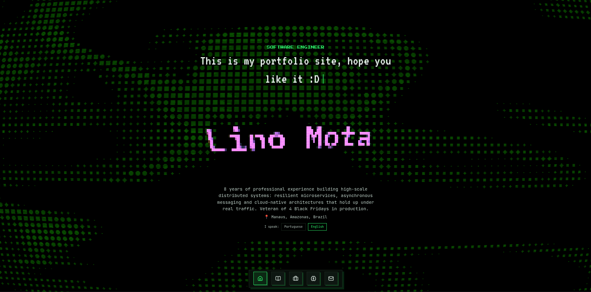

# Lino Mota | Portfolio

Portfólio pessoal estático, bilíngue (PT/EN).



## Stack

- [Vite](https://vitejs.dev/) + React + TypeScript
- [Tailwind CSS v4](https://tailwindcss.com/)
- [Three.js](https://threejs.org/) (ASCII text effect) + [ogl](https://github.com/oframe/ogl) (terminal background shader)
- [Framer Motion](https://www.framer.com/motion/)
- [Lenis](https://lenis.darkroom.engineering/) (smooth scroll for the experience stack)
- Componentes de UI adaptados do [React Bits](https://reactbits.dev/)

## Desenvolvimento

```bash
npm install
npm run dev
```

## Build

```bash
npm run build
npm run preview
```

## Deploy no GitHub Pages

O workflow em [.github/workflows/deploy.yml](.github/workflows/deploy.yml) builda e publica o site automaticamente a cada push na branch `master`, via GitHub Actions + GitHub Pages.

Passos únicos no GitHub, antes do primeiro deploy:

1. Repositório: `LinoMota/LinoMota.github.io`, branch `master`.
2. Em **Settings → Pages**, em "Build and deployment", selecione **Source: GitHub Actions**.
3. Pronto: todo push em `master` dispara o build e publica o site.

## Conteúdo

Os textos (PT/EN) em [src/data/content.ts](src/data/content.ts) são gerados a partir do [src/data/site-content/](src/data/site-content/), produzido pelo subprojeto [dynamic-cv/](dynamic-cv/) - um CLI que transforma dados de currículo em PDFs localizados + conteúdo do site. Para atualizar experiências, skills ou formação, veja o [README do dynamic-cv](dynamic-cv/README.md).
